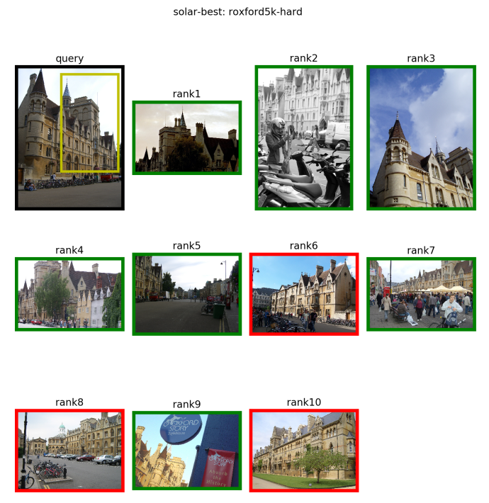

# SOLAR: Second-Order Loss and Attention for Image Retrieval


This repository contains the PyTorch implementation of our ECCV 2020 paper "SOLAR: Second-Order Loss and Attention for Image Retrieval".

Before you go any further, please check out [Filip Radenovic's great repository on image retrieval.](https://github.com/filipradenovic/cnnimageretrieval-pytorch) Our `solar-global` module is heavily built upon it. If you use this code in your research, please also kindly cite their work(s)!
## Features
- [x] Complete test scripts for large-scale image retrieval with `solar-global`
- [x] Inference code for extracting local descriptors with `solar-local`
- [x] Second-order attention map visualisation for large images
- [x] Matching performance visualisation
- [ ] Training code for image-retrieval (**coming soon!**)
- [ ] Training code for local descriptors

## Requirements
- Python 3
- [PyTorch](https://pytorch.org/get-started/locally/) tested on 1.3.0 - 1.5.1, torchvision 0.5+
- [TensorBoard](https://www.tensorflow.org/tensorboard) tested on 2.0.0+
- numpy
- PIL
- [h5py](https://pypi.org/project/h5py/)
- [tqdm](https://github.com/tqdm/tqdm)

## Download model weights and descriptors
Begin with downloading our best models (both global and local) described in the paper, as well as the pre-computed descriptors of the [1M distractors set](https://github.com/filipradenovic/revisitop).

```
sh download.sh
```

The global model is saved at `data/networks/resnet101-solar-best.pth` and the local model is save at `solar_local/weights/local-solar-345-liberty.pth`. The descriptors of the 1M distractors are saved in the main directory (the file is quite big ~8GB, so it might take a while to download).

## Testing our global descriptor
Here you can try out our pretrained model `resnet101-solar-best.pth` on the [Revisiting Oxford and Paris](https://github.com/filipradenovic/revisitop) dataset

<details>
<summary><b>Testing on R-Oxford, R-Paris</b></summary></br>
Given that you've successfully downloaded the global model weights, run

```
python3 -m solar_global.examples.test_e2e
```

After a while, you should be able to get results like this:
```
>> roxford5k: mAP E: 85.88, M: 69.9, H: 47.91
>> roxford5k: mP@k[1, 5, 10] E: [94.12 92.45 88.8 ], M: [94.29 90.86 86.71], H: [88.57 74.29 63.  ]

>> rparis6k: mAP E: 92.95, M: 81.57, H: 64.45
>> rparis6k: mP@k[1, 5, 10] E: [100.   96.57 95.43], M: [100.   98.   97.14], H: [97.14 94.57 93.  ]
```

Retrieval results is visualised in `specs/` using
```
tensorboard --logdir specs/ --samples_per_plugin images=1000
```
You should be able view them on your browser at `localhost:6006`. Here's an example


</details>

<details>
<summary><b>Testing with the extra 1-million distractors</b></summary></br>

```
python3 -m solar_global.examples.test_e2e_1m
```
</details>

## Visualisating second-order attention maps